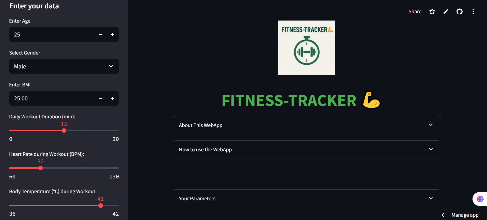

# 🏋️ FITNESS-TRACKER 🧠

> An AI-powered fitness assistant — because your health deserves data.

## AI-Based Calorie Burn Prediction Web App

A budget-friendly virtual fitness assistant that predicts calories burned using user input and machine learning, without requiring wearable devices.

 <!-- Optional: Add a screenshot image path -->

---

  

🚀 Live App:

[**Click here to open the web app**](https://fitness-tracker-9090.streamlit.app/)

---
📖 About the Project

FITNESS-TRACKER is a smart, simple, and powerful ML-based web app built using Streamlit. It lets users estimate calories burned during workouts using personal data — no smartwatch, no subscription, no nonsense.

Perfect for:

Budget-conscious fitness enthusiasts 🏃

Students learning AI/ML 📚

Curious minds with gym vibes 🧠💪

---

🧠 Features

📋 User form for inputting fitness data

🧠 AI model: RandomForestRegressor

📊 Interactive Plotly charts

📈 R² Score-based performance check

🧍 Personalized fitness insights

🌐 Deploy-ready with Streamlit

---

🧰 Tech Stack

Frontend: Streamlit

ML Model: Scikit-learn (RandomForestRegressor)

Data Handling: Pandas

Visualization: Plotly

Deployment: Streamlit Cloud

---

🌱 Future Enhancements

📊 Weekly progress graphs

🧾 PDF summary reports

🧠 Smarter predictions with more features

🪪 User login + history tracking

🍎 Add metrics like sleep, water, steps

---

## 👤 Author

**Prem Sai (MUPPALAM PREMSAI)**

- GitHub: [@prem90902304](https://github.com/prem90902304)
- LinkedIn: [linkedin.com/in/muppalam-premsai-25959b348](https://linkedin.com/in/muppalam-premsai-25959b348)

---

📜 License

Licensed under the MIT License.
Free to use, share, remix, and build on!
